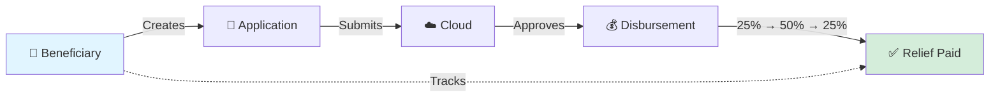
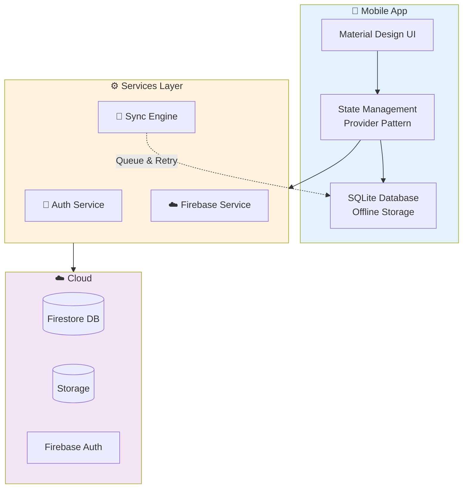
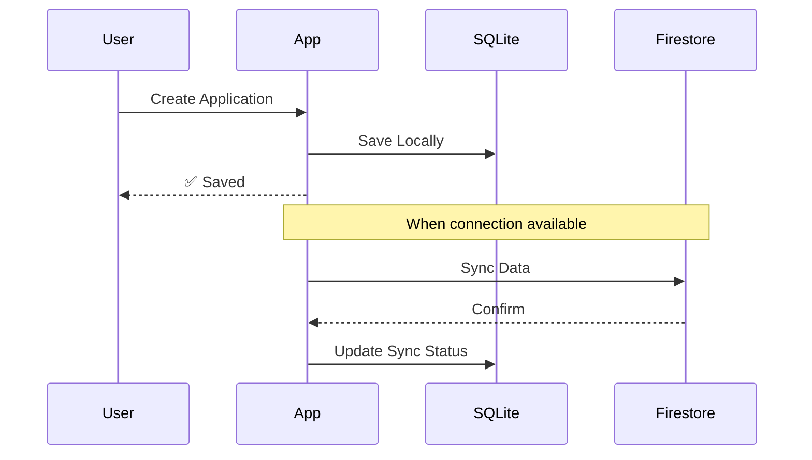

<div align="center">

# 🚀 Nyantra Mobile

### *Direct Benefit Transfer Made Simple*

[](https://flutter.dev)
[](https://dart.dev)
[](https://firebase.google.com)
[]()

**Empowering social justice through accessible, offline-first technology**

[Features](#-what-it-does) • [Architecture](#-architecture) • [Tech Stack](#-tech-stack) • [Setup](#-quick-start)

</div>

---

## 🎯 What Is This?

A **Flutter mobile app** that helps beneficiaries apply for and track government relief funds under the SC/ST Prevention of Atrocities Act. Think of it as your pocket-sized advocate that works even without internet.



### Why It Matters
- 🌐 **Works Offline** – No internet? No problem. Data syncs when connected
- 🗣️ **Voice Input** – Speak your application (accessibility++)
- 🌍 **Multi-Language** – English & Hindi support
- 🔒 **Secure** – Firebase Auth + encrypted local storage

---

## ✨ What It Does

<table>
<tr>
<td width="50%">

### 👥 **Beneficiary Management**
Register profiles, upload documents, manage identities

### 📝 **Application System**
Create, edit, save drafts, submit applications

### 💰 **Payment Tracking**
Monitor 3-stage disbursement (25%→50%→25%)

</td>
<td width="50%">

### 📢 **Grievance Support**
File complaints, track resolutions

### 📊 **Dashboard Analytics**
Overview of applications, payments, status

### 🔄 **Smart Sync**
Auto-sync when online, queue when offline

</td>
</tr>
</table>

---

## 🏗️ Architecture



### Data Flow
1. **Offline Mode**: User creates application → Saves to SQLite → Queued for sync
2. **Online Mode**: Sync engine uploads → Firestore stores → Real-time updates
3. **Conflict Resolution**: Smart merge when offline edits clash with server

---

## 🛠️ Tech Stack

<div align="center">

| Layer | Technology |
|-------|-----------|
| **Framework** | Flutter 3.8+ |
| **Language** | Dart 3.8+ |
| **State** | Provider |
| **Backend** | Firebase (Auth, Firestore, Storage) |
| **Database** | SQLite |
| **Navigation** | GoRouter |
| **i18n** | flutter_localizations |
| **Features** | Speech-to-Text, PDF Generation, Connectivity Detection |

</div>

### Key Dependencies
```yaml
firebase_core, firebase_auth, cloud_firestore   # Backend
provider                                         # State management  
sqflite                                         # Offline storage
go_router                                       # Navigation
speech_to_text, pdf, printing                   # Advanced features
connectivity_plus                               # Network detection
```

---

## 📂 Project Structure

```
lib/
├── main.dart                          # App entry point
└── src/
    ├── core/                          # Core functionality
    │   ├── providers/                 # State management
    │   │   ├── auth_provider.dart
    │   │   ├── connectivity_provider.dart
    │   │   └── sync_status_provider.dart
    │   └── services/                  # Business logic
    │       ├── firebase_service.dart
    │       └── sync_service.dart
    ├── features/                      # Feature modules
    │   ├── auth/                      # Authentication
    │   ├── beneficiaries/             # Profile management
    │   ├── dashboard/                 # Main dashboard
    │   ├── disbursements/             # Payment tracking
    │   └── grievances/                # Complaint system
    └── components/                    # Reusable widgets
```

---

## 🚀 Quick Start

### Prerequisites
- Flutter 3.8+ installed ([Get Flutter](https://flutter.dev))
- Firebase project configured
- Android Studio / VS Code

### Installation

```bash
# Clone the repository
git clone <repo-url>
cd Nyantra-Mobile

# Install dependencies
flutter pub get

# Run the app
flutter run
```

### Firebase Setup
1. Create a Firebase project at [console.firebase.google.com](https://console.firebase.google.com)
2. Add `google-services.json` to `android/app/`
3. Enable Authentication, Firestore, and Storage
4. Update Firebase configuration in the app

---

## 🎨 Features Showcase

### Offline-First Design


### Disbursement Stages
```
┌──────────────────────────────────────────────┐
│  Application Approved                        │
└──────────────────────────────────────────────┘
           │
           ├─► Stage 1: 25% Immediate Relief ✅
           │
           ├─► Stage 2: 50% Interim Payment  ⏳
           │
           └─► Stage 3: 25% Final Settlement ⏳
```

---

## 🔒 Security Features

- ✅ Firebase Authentication with Google Sign-In
- ✅ Role-based access control (Beneficiary/Officer)
- ✅ Encrypted local database
- ✅ Secure document storage
- ✅ Session management & token handling

---

## 🌍 Localization

Supports multiple languages with easy extensibility:
- 🇬🇧 English
- 🇮🇳 Hindi
- Easily add more in `assets/translations/`

---

## 📄 License

Private Project – All Rights Reserved

---

<div align="center">

**Built with ❤️ for Social Justice**

*Making government relief accessible to everyone, everywhere*

</div>
- **PDF Generation**: Export applications and receipts
- **Email Integration**: Send documents and notifications
- **Internationalization**: Easy language switching
- **Permission Management**: Camera, storage, microphone access
- **Shared Preferences**: Persistent user settings
- **URL Launching**: External links and document viewing

---

## 🏗️ Architecture

### Project Structure
```
lib/
├── main.dart                          # Application entry point
├── src/
│   ├── components/
│   │   └── AnimatedBackground.dart    # Reusable animated UI component
│   ├── core/
│   │   ├── models/                    # Data models
│   │   │   ├── activity_model.dart
│   │   │   ├── alert_model.dart
│   │   │   ├── application_model.dart
│   │   │   ├── beneficiary_model.dart
│   │   │   ├── disbursement_model.dart
│   │   │   ├── feedback_model.dart
│   │   │   ├── grievance_model.dart
│   │   │   ├── report_model.dart
│   │   │   └── user_model.dart
│   │   ├── providers/                 # State management
│   │   │   ├── auth_provider.dart
│   │   │   ├── connectivity_provider.dart
│   │   │   ├── locale_provider.dart
│   │   │   ├── sync_status_provider.dart
│   │   │   └── theme_provider.dart
│   │   ├── services/                  # Business logic layer
│   │   │   ├── alert_service.dart     # Notification management
│   │   │   ├── database_helper.dart   # SQLite operations
│   │   │   ├── data_service.dart      # Data access layer
│   │   │   ├── email_service.dart     # Email functionality
│   │   │   ├── firebase_service.dart  # Firebase initialization
│   │   │   └── sync_service.dart      # Offline-online sync
│   │   └── widgets/                   # Shared UI components
│   └── features/
│       ├── auth/                      # Authentication feature
│       │   └── screens/
│       │       └── login_screen.dart
│       ├── core/                      # Core feature modules
│       └── dashboard/                 # Main dashboard feature
│           ├── screens/
│           │   ├── application_create_page.dart
│           │   ├── application_edit_page.dart
│           │   ├── beneficiary_form_page.dart
│           │   ├── beneficiary_edit_page.dart
│           │   └── dashboard_screen.dart
│           └── widgets/
│               ├── applications_page.dart
│               ├── beneficiaries_page.dart
│               ├── dashboard_content.dart
│               ├── disbursements_page.dart
│               ├── feedback_page.dart
│               ├── grievance_page.dart
│               ├── sidebar.dart
│               └── sync_status_widget.dart
```

### Data Flow
1. **UI Layer** (Screens/Widgets) → User interactions
2. **Provider Layer** (State Management) → Business logic and state
3. **Service Layer** (Services) → Data operations and API calls
4. **Data Layer** (Models + SQLite + Firestore) → Persistence

### Offline-First Strategy
```
User Action → Local DB (SQLite) → UI Update → Background Sync → Firestore
                ↓                                              ↓
           Instant Feedback                            Cloud Backup
```

---

## 🛠️ Technology Stack

### Core Framework
| Component | Technology | Version | Purpose |
|-----------|------------|---------|---------|
| Framework | Flutter | 3.8+ | Cross-platform UI |
| Language | Dart | 3.8+ | Programming language |
| SDK | Flutter SDK | Latest stable | Development kit |

### Firebase Services
| Service | Package | Version | Purpose |
|---------|---------|---------|---------|
| Core | `firebase_core` | ^3.0.0 | Firebase initialization |
| Authentication | `firebase_auth` | ^5.0.0 | User authentication |
| Database | `cloud_firestore` | ^5.0.0 | Cloud database |
| Storage | Firebase Storage | - | Document storage |

### State Management & Architecture
| Component | Package | Version | Purpose |
|-----------|---------|---------|---------|
| State Management | `provider` | ^6.1.1 | Reactive state |
| Navigation | `go_router` | ^14.0.0 | Declarative routing |
| Local Database | `sqflite` | ^2.3.3 | SQLite persistence |
| Connectivity | `connectivity_plus` | ^6.0.3 | Network detection |

### UI & User Experience
| Component | Package | Version | Purpose |
|-----------|---------|---------|---------|
| Animations | `flutter_animate` | ^4.5.0 | UI animations |
| Material Design | Flutter Built-in | - | Design system |
| Localization | `flutter_localizations` | SDK | Multi-language |
| Intl | `intl` | ^0.20.2 | Internationalization |

### Authentication & Social
| Component | Package | Version | Purpose |
|-----------|---------|---------|---------|
| Google Sign-In | `google_sign_in` | ^6.2.1 | OAuth integration |
| Firebase Auth | `firebase_auth` | ^5.0.0 | Authentication |

### Device & Platform
| Component | Package | Version | Purpose |
|-----------|---------|---------|---------|
| Permissions | `permission_handler` | ^11.3.1 | Runtime permissions |
| Speech Recognition | `speech_to_text` | ^7.0.0 | Voice input |
| URL Launcher | `url_launcher` | ^6.2.5 | External links |
| Path Provider | `path_provider` | ^2.1.3 | File system access |
| Shared Preferences | `shared_preferences` | ^2.2.2 | Key-value storage |

### Document & Reporting
| Component | Package | Version | Purpose |
|-----------|---------|---------|---------|
| PDF Generation | `pdf` | ^3.10.7 | PDF creation |
| Printing | `printing` | ^5.13.3 | PDF rendering |

### Networking
| Component | Package | Version | Purpose |
|-----------|---------|---------|---------|
| HTTP Client | `http` | ^1.2.1 | REST API calls |

### Development Tools
| Tool | Purpose |
|------|---------|
| `flutter_lints` | Code quality and style enforcement |
| `flutter_test` | Unit and widget testing |
| Git | Version control |
| Firebase Console | Backend management |

---

## 🚀 Getting Started

### Prerequisites
- **Flutter SDK**: 3.8.0 or higher
- **Dart SDK**: 3.8.1 or higher
- **Android Studio** / **VS Code** with Flutter extensions
- **Xcode** (for iOS development, macOS only)
- **Firebase Account**: Project setup required
- **Git**: For version control

### Installation

1. **Clone the Repository**
   ```bash
   git clone https://github.com/Anish-2005/Nyantra-Mobile.git
   cd Nyantra-Mobile
   ```

2. **Install Dependencies**
   ```bash
   flutter pub get
   ```

3. **Firebase Configuration**
   - The project includes `google-services.json` for Android
   - For iOS, ensure `GoogleService-Info.plist` is in `ios/Runner/`
   - Firebase project ID: `nyantara-388dd`

4. **Verify Installation**
   ```bash
   flutter doctor
   ```

### Running the Application

#### Development Mode
```bash
# Run on connected device/emulator
flutter run

# Run with specific device
flutter run -d <device-id>

# Run with hot reload enabled (default)
flutter run --hot
```

#### Platform-Specific Commands

**Android**
```bash
# Debug build
flutter run -d android

# Release build
flutter build apk --release

# App bundle (for Play Store)
flutter build appbundle --release
```

**iOS**
```bash
# Debug build
flutter run -d ios

# Release build
flutter build ios --release
```

**Web**
```bash
# Run web version
flutter run -d chrome

# Build web
flutter build web
```

**Desktop**
```bash
# Windows
flutter run -d windows
flutter build windows

# macOS
flutter run -d macos
flutter build macos

# Linux
flutter run -d linux
flutter build linux
```

### Development Workflow

1. **Code Quality**
   ```bash
   # Run linter
   flutter analyze

   # Format code
   flutter format .
   ```

2. **Testing**
   ```bash
   # Run all tests
   flutter test

   # Run with coverage
   flutter test --coverage
   ```

3. **Clean Build**
   ```bash
   # Clean build cache
   flutter clean

   # Reinstall dependencies
   flutter pub get
   ```

---

## 🗄️ Firebase Setup

### Firebase Services Used
- **Authentication**: Email/password + Google Sign-In
- **Cloud Firestore**: Real-time database
- **Cloud Storage**: Document and image storage
- **Cloud Functions**: Backend logic (if applicable)
- **Analytics**: User behavior tracking
- **Crashlytics**: Error reporting

### Collections Structure
```
users/
├── {userId}
│   ├── email
│   ├── role
│   ├── createdAt
│   └── ...

beneficiaries/
├── {beneficiaryId}
│   ├── name
│   ├── contact
│   ├── documents[]
│   └── ...

applications/
├── {applicationId}
│   ├── beneficiaryId
│   ├── status
│   ├── createdAt
│   ├── documents[]
│   └── ...

disbursements/
├── {disbursementId}
│   ├── applicationId
│   ├── amount
│   ├── stage
│   ├── transactionId
│   └── ...

grievances/
├── {grievanceId}
│   ├── userId
│   ├── category
│   ├── status
│   ├── description
│   └── ...

feedback/
├── {feedbackId}
│   ├── userId
│   ├── rating
│   ├── comments
│   └── ...
```

---

## 🎨 Features Deep Dive

### Internationalization (i18n)
The app supports multiple languages with easy extensibility:
- **Current Languages**: English (`en.json`), Hindi (`hi.json`)
- **Translation Files**: `assets/translations/`
- **3699+ translation keys** covering entire application
- Dynamic language switching without app restart

### Offline Synchronization
**How it works:**
1. All CRUD operations write to local SQLite database first
2. UI updates immediately with local data
3. Background sync service monitors connectivity
4. When online, pending changes are pushed to Firestore
5. Conflict resolution handles concurrent edits
6. Pull updates from Firestore to local database

**Sync Status Indicators:**
- ✅ Synced
- 🔄 Syncing
- ⏸️ Offline
- ⚠️ Sync Error

### Role-Based Access Control
- **Beneficiary Role**: Submit applications, track status, view disbursements
- **Officer Role**: Review applications, process disbursements, manage grievances
- Permissions enforced both client-side and server-side (Firestore rules)

### Accessibility Features
- **Screen Reader Support**: Semantic labels for all UI elements
- **Speech-to-Text**: Voice input for text fields
- **High Contrast Mode**: Enhanced visibility
- **Font Scaling**: Respects system font size settings
- **Keyboard Navigation**: Full keyboard support

---

## 📊 Data Models

### Key Models
- **UserModel**: User profile and authentication data
- **BeneficiaryModel**: Beneficiary information and documents
- **ApplicationModel**: Relief application details
- **DisbursementModel**: Payment tracking and stages
- **GrievanceModel**: Complaint and resolution tracking
- **FeedbackModel**: User feedback and ratings
- **ActivityModel**: User activity logs
- **AlertModel**: Notification and alert data
- **Report**: Analytics and reporting data

Each model includes:
- JSON serialization/deserialization
- Validation logic
- Type-safe properties
- Null safety compliance

---

## 🔧 Configuration

### Environment Variables
- Firebase configuration in `google-services.json` (Android)
- iOS configuration in `GoogleService-Info.plist`
- API keys managed through Firebase Console

### App Configuration
- **Package Name**: `com.example.user_nyantra`
- **App Name**: Nyantra Mobile
- **Version**: 1.0.0+1
- **Min SDK**: Android 21+ (Lollipop)
- **iOS Target**: iOS 12.0+

### Build Configuration
- **Debug**: Development builds with hot reload
- **Profile**: Performance profiling builds
- **Release**: Production-optimized builds

---

## 📈 Performance Optimization

- **Lazy Loading**: On-demand data fetching
- **Image Caching**: Efficient image management
- **State Optimization**: Provider scoping for minimal rebuilds
- **Database Indexing**: SQLite query optimization
- **Connection Pooling**: Efficient Firestore connections
- **Code Splitting**: Modular feature architecture

---

## 🔒 Security Best Practices

- ✅ Firebase Security Rules implemented
- ✅ Local database encryption ready
- ✅ Secure token management
- ✅ Input validation and sanitization
- ✅ No hardcoded credentials
- ✅ HTTPS-only communication
- ✅ Certificate pinning ready

---

## 🧪 Testing

```bash
# Run all tests
flutter test

# Run specific test file
flutter test test/widget_test.dart

# Run with coverage
flutter test --coverage

# Integration tests
flutter drive --target=test_driver/app.dart
```

---

## 📦 Build & Deployment

### Android Release Build
```bash
# Generate release APK
flutter build apk --release --split-per-abi

# Generate app bundle (recommended for Play Store)
flutter build appbundle --release

# Output location
# build/app/outputs/bundle/release/app-release.aab
# build/app/outputs/apk/release/app-arm64-v8a-release.apk
```

### iOS Release Build
```bash
# Build iOS release
flutter build ios --release

# Archive in Xcode
open ios/Runner.xcworkspace
# Then: Product → Archive → Distribute App
```

---

## 🤝 Contributing

This is a private repository. For authorized contributors:

1. Create a feature branch: `git checkout -b feature/your-feature`
2. Commit changes: `git commit -m 'Add some feature'`
3. Push to branch: `git push origin feature/your-feature`
4. Submit a pull request

### Code Standards
- Follow Flutter/Dart style guide
- Use `flutter format` before committing
- Ensure `flutter analyze` passes
- Write meaningful commit messages
- Add comments for complex logic

---

## 📄 License

Private and proprietary. All rights reserved.

---

## 👨‍💻 Developers

**Repository Owner**: [Anish-2005](https://github.com/Anish-2005)

---

## 📞 Support

For issues, questions, or feedback:
- Create an issue in the repository
- Contact the development team
- Check Firebase Console for backend issues

---

## 🗺️ Roadmap

### Planned Features
- [ ] Biometric authentication
- [ ] DigiLocker integration
- [ ] Advanced analytics dashboard
- [ ] Multi-file upload improvements
- [ ] Enhanced offline capabilities
- [ ] Regional language expansion
- [ ] Push notification enhancements
- [ ] In-app chat support

---

## 📚 Additional Resources

- [Flutter Documentation](https://docs.flutter.dev/)
- [Dart Language Tour](https://dart.dev/guides/language/language-tour)
- [Firebase for Flutter](https://firebase.google.com/docs/flutter/setup)
- [Material Design 3](https://m3.material.io/)
- [Provider Package](https://pub.dev/packages/provider)

---

<div align="center">
  <p>Built with ❤️ for Social Justice</p>
  <p><strong>Nyantra Mobile - Empowering Justice Through Technology</strong></p>
</div>
|----------|-----------|---------|---------|
| **Framework** | Flutter | 3.8+ | Cross-platform mobile development |
| **Language** | Dart | 3.8+ | Optimized for mobile performance |
| **State Management** | Provider | 6.1+ | Reactive state management pattern |
| **Backend** | Firebase SDK | 3.0+ | Same backend as web application |
| **Local Storage** | Shared Preferences | 2.2+ | Persistent local data storage |
| **Offline Support** | SQLite (sqflite) | 2.3+ | Local database for offline functionality |
| **PDF Generation** | pdf + printing | 3.10+ / 5.13+ | Mobile PDF creation and export |
| **Speech Input** | speech_to_text | 7.0+ | Voice-enabled form filling |
| **Navigation** | go_router | 14.0+ | Declarative routing and deep linking |
| **Animations** | flutter_animate | 4.5+ | Declarative animations |
| **Network** | http + connectivity_plus | 1.2+ / 6.0+ | API calls and network monitoring |


## 🎨 Design System

- **Themes**: Light/Dark mode with CSS custom properties
- **Typography**: System fonts with fallbacks
- **Color Palette**: Accessible color combinations
- **Components**: Glassmorphism effects and smooth animations
- **Responsive**: Mobile-first design with breakpoint system

---

## 🌐 Internationalization

- **Languages**: English (en) and Hindi (hi)
- **Implementation**: JSON-based translations with React Context
- **Coverage**: Complete UI translation with RTL support ready
- **Management**: Automated scripts for key extraction and validation

---

## 🔒 Security & Privacy

- **Authentication**: Firebase Auth with email/password and Google sign-in
- **Authorization**: Role-based access control (Admin/User)
- **Data Encryption**: Firebase's built-in encryption at rest
- **API Security**: Server-side validation and input sanitization
- **Privacy**: GDPR-compliant data handling practices

---

## 📈 Performance

- **Web Vitals**: Optimized for Core Web Vitals
- **Bundle Size**: Tree-shaken imports and lazy loading
- **Caching**: Intelligent caching strategies
- **Mobile**: Optimized for low-bandwidth environments
- **PWA Ready**: Service worker and offline capabilities

---

## 🤝 Contributing

1. Fork the repository
2. Create a feature branch (`git checkout -b feature/amazing-feature`)
3. Commit your changes (`git commit -m 'Add amazing feature'`)
4. Push to the branch (`git push origin feature/amazing-feature`)
5. Open a Pull Request

### Development Guidelines
- Follow TypeScript strict mode
- Use ESLint and Prettier for code formatting
- Write tests for new features
- Update documentation for API changes
- Ensure accessibility compliance

---

## 📄 License

This project is licensed under the MIT License - see the [LICENSE](LICENSE) file for details.

---

## 🙏 Acknowledgments

- Built for disaster relief management under PM-CARES initiatives
- Inspired by real-world humanitarian aid workflows
- Thanks to the open-source community for the amazing tools and libraries

---

## 📞 Support

For support and questions:
- Create an issue in this repository
- Contact the development team
- Check the documentation in `/docs` folder

---

*Built with ❤️ for efficient disaster relief operations*

