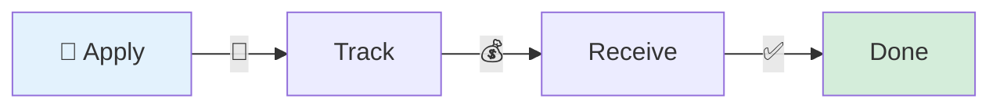
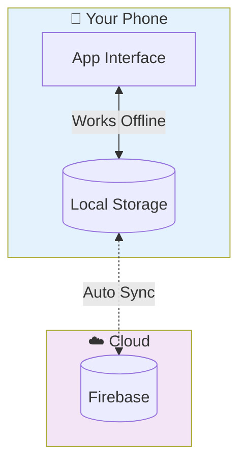
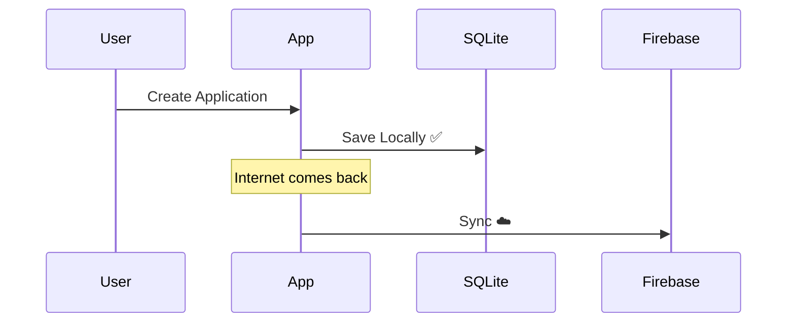

<div align="center">

# 🚀 Nyantra Mobile

### *Government Relief at Your Fingertips*

[](https://flutter.dev)
[](https://dart.dev)
[](https://firebase.google.com)
[]()

**Mobile app for SC/ST Act relief applications • Works offline • Voice-enabled • Multi-language**

</div>

---

## 💡 What It Does



Help beneficiaries **apply**, **track**, and **receive** government relief funds under the SC/ST Prevention of Atrocities Act. All from their phone. Even without internet.

### 🎯 Core Features

| Feature | What It Does |
|---------|--------------|
| 📱 **Applications** | Create & submit relief applications with voice input |
| 💰 **Payments** | Track 3-stage disbursement (25% → 50% → 25%) |
| 📊 **Dashboard** | Real-time overview of all applications & payments |
| 🗣️ **Voice Input** | Speak your forms (accessibility feature) |
| 🌐 **Offline Mode** | Full functionality without internet |
| 🔄 **Auto-Sync** | Data syncs automatically when connected |

---

## 🏗️ How It Works



**Offline-First Architecture**
- Create applications offline → Saved locally → Auto-syncs when online
- All data backed up to cloud
- Smart conflict resolution

---

## 🛠️ Built With

| Layer | Tech |
|-------|------|
| **Frontend** | Flutter 3.8+ (Dart) |
| **State** | Provider |
| **Backend** | Firebase (Auth, Firestore, Storage) |
| **Database** | SQLite (offline) |
| **Features** | Voice-to-Text • PDF Generation • Multi-language |

---

## 📁 Project Structure

```
lib/
├── main.dart              # Entry point
└── src/
    ├── core/              # Providers, Services, Models
    ├── features/          # Auth, Dashboard, Applications
    │   ├── auth/
    │   ├── beneficiaries/
    │   ├── disbursements/
    │   └── grievances/
    └── components/        # Reusable UI widgets
```

---

## 🚀 Quick Start

```bash
# 1. Clone & navigate
git clone <repo-url>
cd Nyantra-Mobile

# 2. Install dependencies
flutter pub get

# 3. Run
flutter run
```

**Firebase Setup**: Add `google-services.json` to `android/app/` ([Get it here](https://console.firebase.google.com))

---

## 🎨 Key Features Visualized

### Disbursement Flow
```
Application Approved
        ↓
    Stage 1: 25% ✅ (Immediate)
        ↓
    Stage 2: 50% ⏳ (Processing)
        ↓
    Stage 3: 25% ⏳ (Final)
```

### Offline Sync


---

## 🔐 Security

✅ Firebase Authentication  
✅ Role-based access control  
✅ Encrypted local storage  
✅ Secure cloud backup

## 🌍 Languages

🇬🇧 English • 🇮🇳 हिंदी

---

<div align="center">

**Built with ❤️ for Social Justice**

*Making relief accessible to everyone, everywhere*

